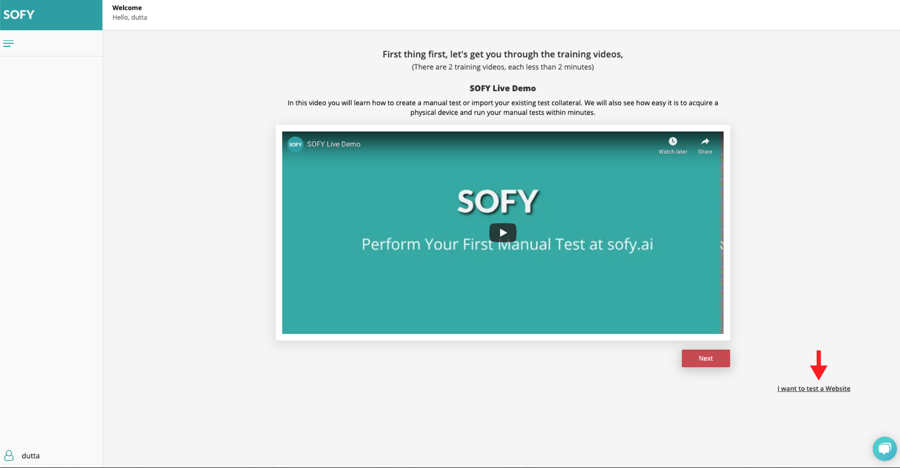
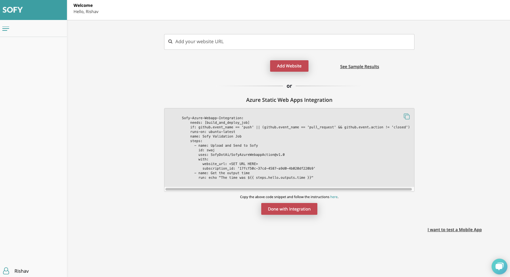
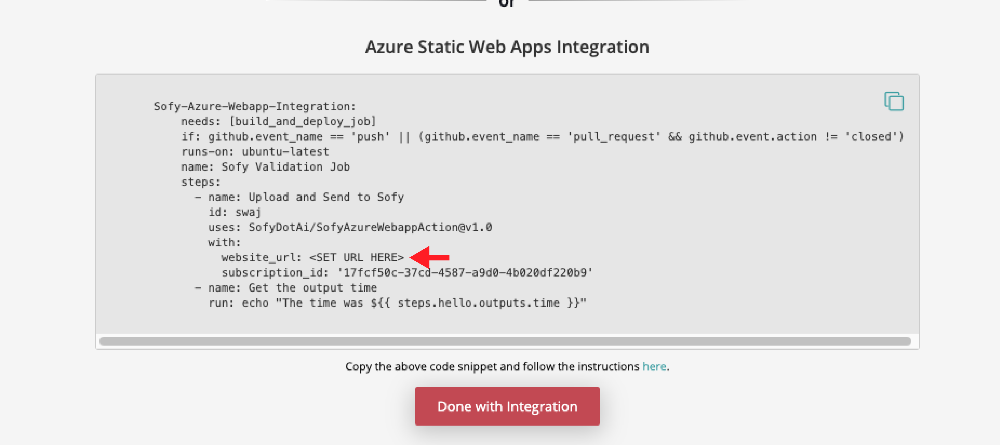

# Sofy Azure Webapp Integration

Sofy for Web integrates into your Azure Static Webapp CI/CD pipeline through Github actions. Sofy will monitor your website and send you exploratory testing results after every push with no input required.

To learn more about Sofy For Web click [here](https://sofy.ai/azure-static-webapp-integration/) 

## Integration Instructions

In order to integrate your Azure Static Webapp with Sofy for Web, you need to first create an account with Sofy. 

1. [Create an Account with Sofy Here](https://sofy.ai/register/)
2. Once your account is created, click on the *I want to test a Website*

	

3. Then copy the YML snippet into the YML script provided by Azure Webapps as a job. This snippet is specific to your account.

	

4. Set `website_url` in the snippet to the endpoint of your Azure Webapp

	

5. Push changes to your Azure Static Webapp repository. 
6. You will receive an email with results every time you push code to the repository.

