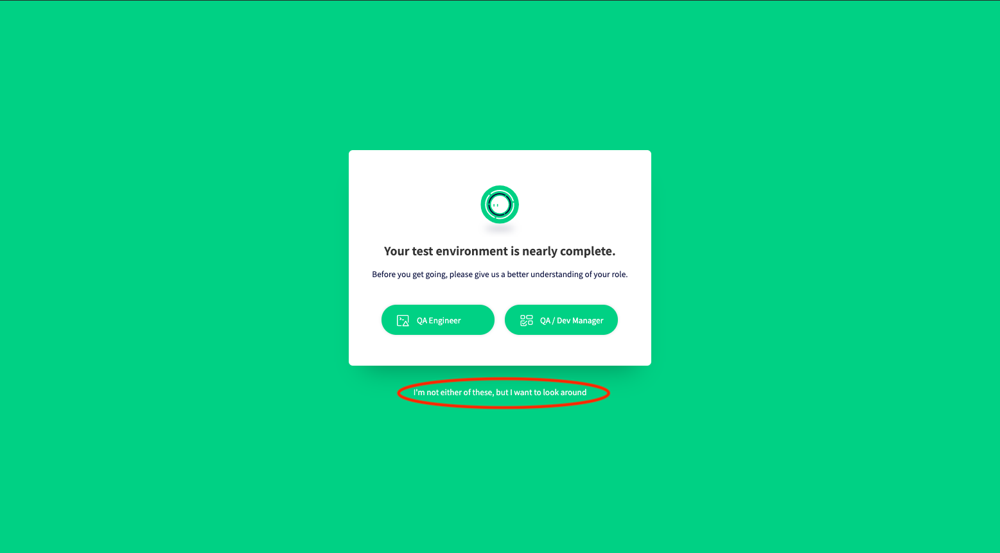
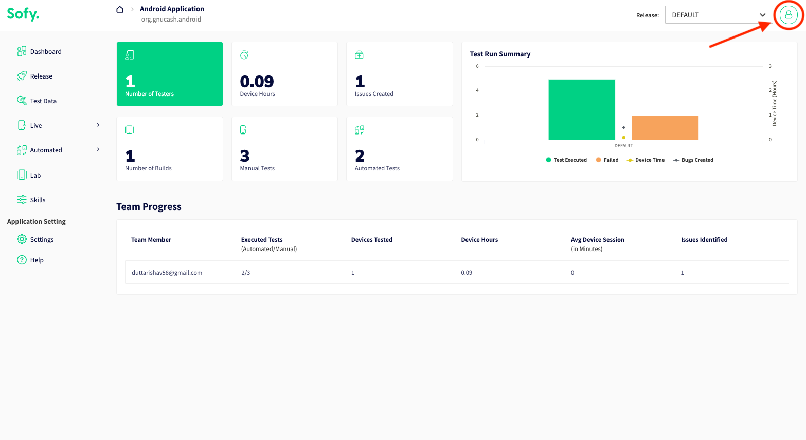
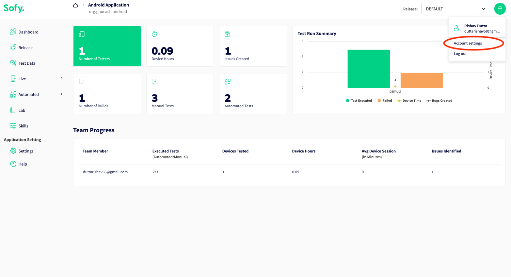
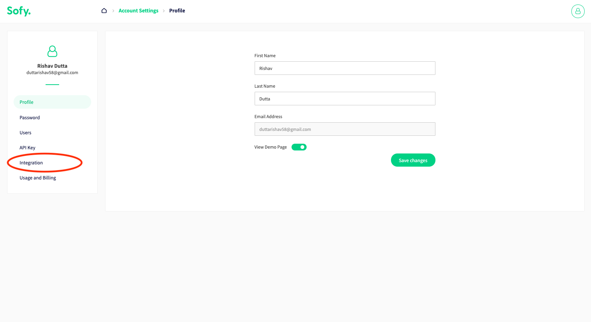
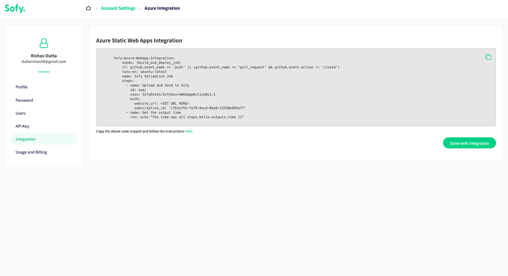
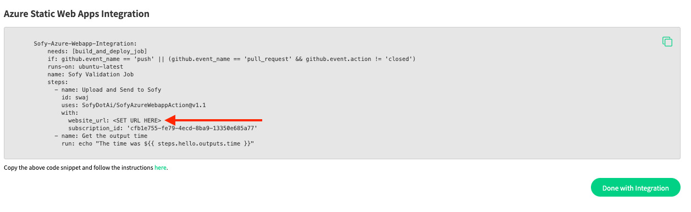

# Sofy Azure Static Webapp Integration

Sofy for Web integrates into your Azure Static Webapp CI/CD pipeline through Github actions. Sofy will monitor your website and send you exploratory testing results after every push with no input required.

## Integration Instructions

In order to integrate your Azure Static Webapp with Sofy for Web, you need to first create an account with Sofy. 

1. [Create an Account with Sofy Here](https://sofy.ai/register/)
2. Once your account is created, log into the Sofy Portal and click *I'm not either of these but I want to look around*

	

3. Then click *Get a tour*

	

4. Then click the profile icon at the top of the screen

	

5. From the dropdown select *Account Settings*

	

6. Select *Integration* on the left

	

7. Then copy the YML snippet into the YML script provided by Azure Webapps as a job. This snippet is specific to your account.

	

8. Set `website_url` in the YML snippet to the endpoint of your Azure Webapp

	

9. Push changes to your Azure Static Webapp repository. 
10. You will receive an email with results every time you push code to the repository.

